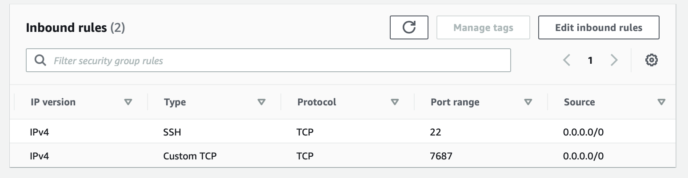
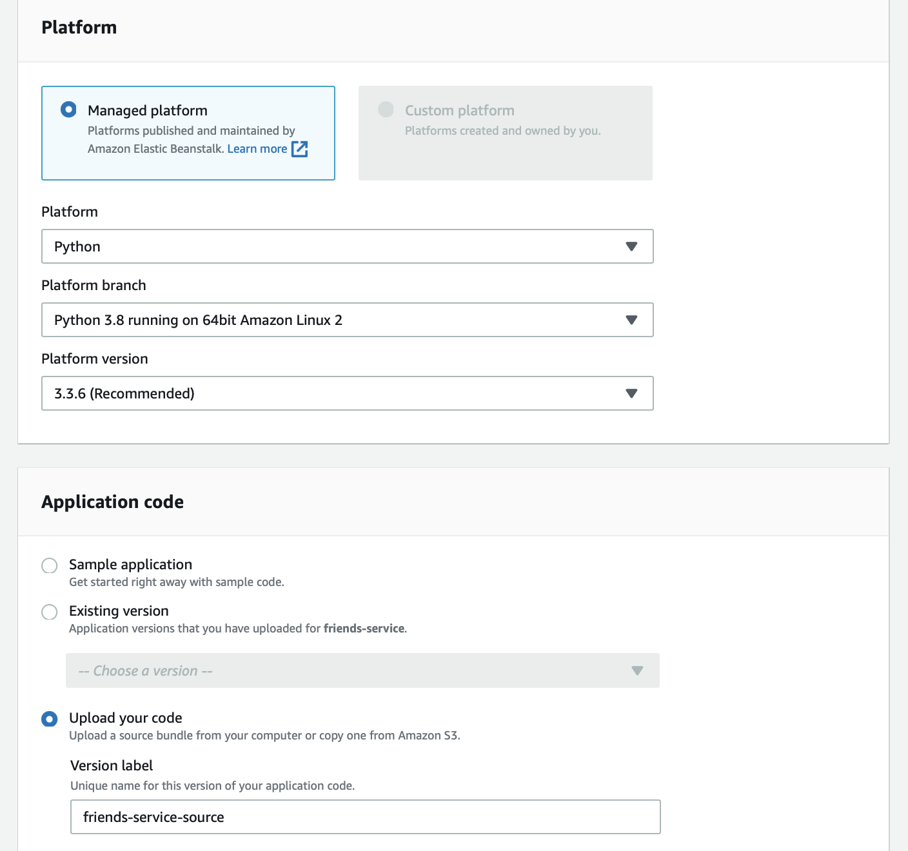

# FriendsService
Friends microservice for Stonks! project.

## How to Setup
### Setup neo4j on Ubuntu 20 (EC2)
- Create free tier eligible EC2 instance with OS set to Ubuntu 20.04. Leave the other setup as default
- Setup the neo4j within it following this [link](https://www.digitalocean.com/community/tutorials/how-to-install-and-configure-neo4j-on-ubuntu-20-04)
- After setting up to listen to 0.0.0.0, run `sudo systemctl restart neo4j.service`
- Create security group that open neo4j port to public (later on we should change it depending on our VPC / EC2 instance) 
- Add it to the EC2 instance
- Get the EC2 public url for beanstalk

### Setup Beanstalk
- git clone 
- `cd FriendsService`
- Create `.ebextensions/environment.config` following `.ebextensions/environment.config.example` format. Change the content accordingly.
- `zip -r ../FriendsService.zip . -x ".DS_Store" -x "__MACOSX"`
- Open amazon console -> beanstalk -> create new environment
- Follow this setup

- Create environment
- notes:
	- https://stackoverflow.com/questions/62479386/no-module-named-application-error-while-deploying-simple-web-app-to-elastic-be
